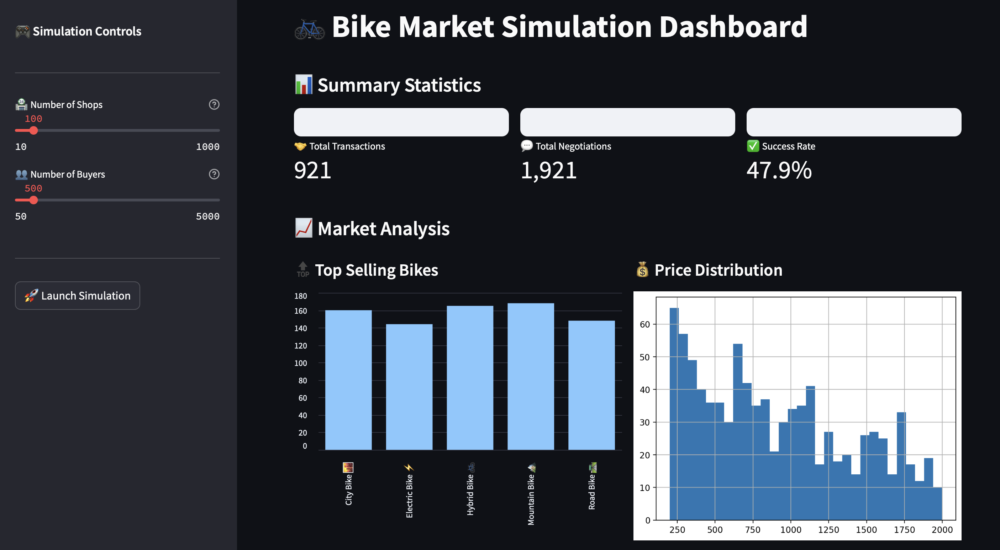

# 🚴‍♂️ Bike Market Simulations

Welcome to **Bike Market Simulations**, a project designed to model a real-time marketplace where buyers and sellers negotiate prices for bikes. This interactive app is built using Streamlit and Python, simulating a dynamic, multi-agent system that provides insights into how negotiation strategies and market dynamics unfold in real time.

## 🎯 Project Highlights

- **Real-Time Marketplace Simulation**: Observe live negotiations between buyers and sellers within a responsive, simulated marketplace.
- **Agent-Based Design**: Each agent (buyer or seller) operates independently, with adaptive strategies to match market conditions.
- **Customizable Scenarios**: Adjust parameters like negotiation frequency, pricing, and acceptance criteria to simulate different market conditions.

## 🚀 Key Features

- **Live Negotiation Tracking**: Watch as buyers and sellers adapt their offers and counteroffers in real time.
- **User-Configurable Settings**: Modify parameters such as buyer demand, seller inventory, price sensitivity, and negotiation tactics to observe their impact on market trends.
- **Extendable Design**: The code structure allows for the easy addition of new agent behaviors, rules, and parameters to create varied scenarios.

## 📂 Repository Structure

- **`app_1.1.py`**: The main file for deploying the Streamlit app. It sets up the simulation environment and oversees interactions between buyers and sellers.
- **`negotiate.py`**: Contains core negotiation logic, including agent behavior rules, price adjustments, and offer/acceptance algorithms.

## 🛠️ Setup & Installation

To run this simulation on your local machine:

1. **Clone this repository**:
   ```bash
   git clone https://github.com/FavianRajendra/BikeMarketSimulations.git
   cd BikeMarketSimulations
   ```

2. **Install required dependencies**:
   ```bash
   pip install -r requirements.txt
   ```

3. **Launch the Streamlit app**:
   ```bash
   streamlit run app_1.1.py
   ```

## 📸 Screenshots

| 
|--------------------------------------------------------|

## 🌍 How It Works

1. **Market Setup**: Buyers and sellers enter the marketplace with defined parameters.
2. **Negotiation Process**: Agents make offers based on market conditions, adapting dynamically to reach deals.
3. **Market Outcomes**: Visualize results to understand negotiation success rates, pricing trends, and agent behavior over time.

## 🌟 Contributing

We welcome contributions! If you're interested in enhancing the model, adding new agent behaviors, or improving the UI, please feel free to fork this repository, open issues, and make pull requests.

## 📜 License

This project is licensed under the MIT License.

